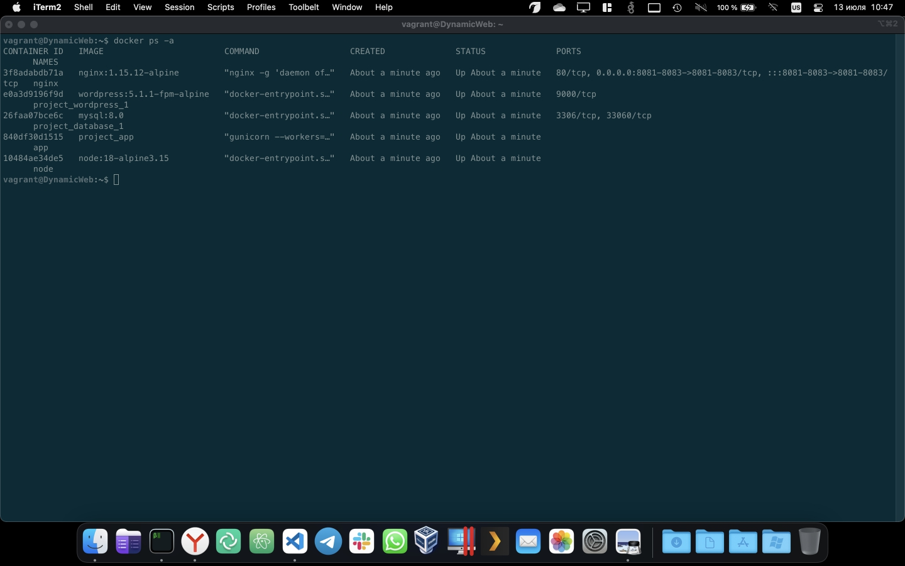
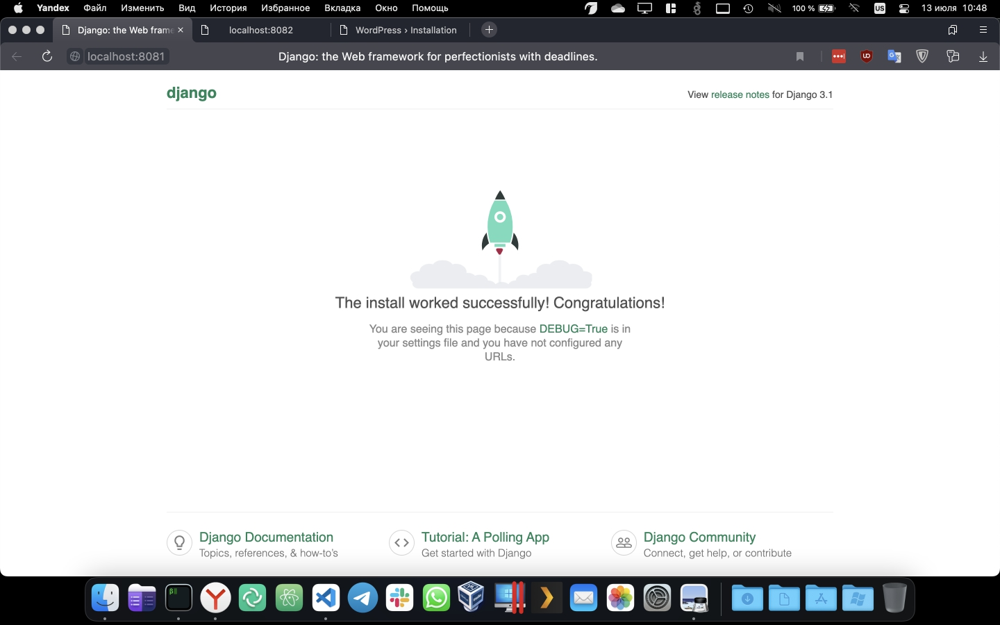
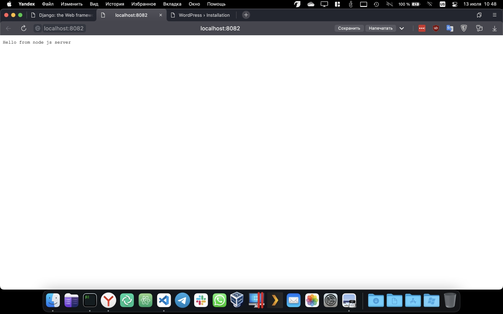
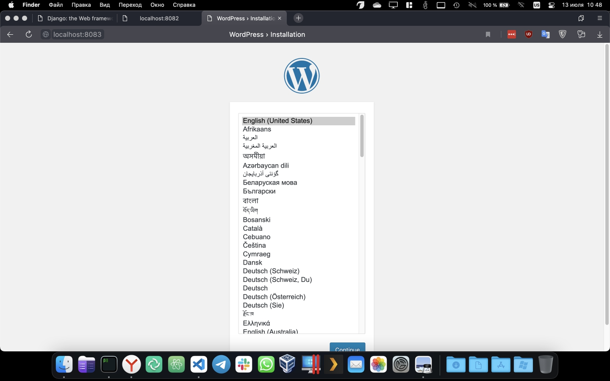

# **HW-26 - DYNAMIC-WEB**
---
- Проект развертывается командой `vagrant up`
- Все задания по мотодичке выполнены.
- Скриншоты работоспособности ниже:
1. CONSOLE

2. DJANGO (порт 8081)

3. NODE.JS (порт 8082)

4. WORDPRESS (порт 8083)

- Выявлены следующие неточности и замечания:
1. Добавление пользователя vagrant в группу docker с помощью модуля ansible почему то не отрабатывало, для ускорения пришлось заменить на shell:
```
    - name: Add remote "vagrant" user to "docker" group
      shell: 
        cmd: "usermod -a -G docker vagrant"
      tags:
        - docker
```
2. Node.JS корректно не стартовала. Вылечилось обновлением на последнюю версию образа `node:18-alpine3.15`
3. Django так же стартовало и сразуже падало. Вылечилось добавлением параметра `--build` (найдено на просторах интернета) в строку запуска docker-compose.
